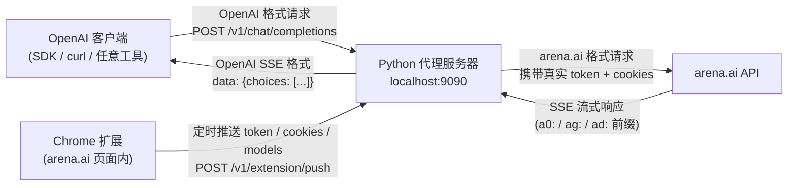
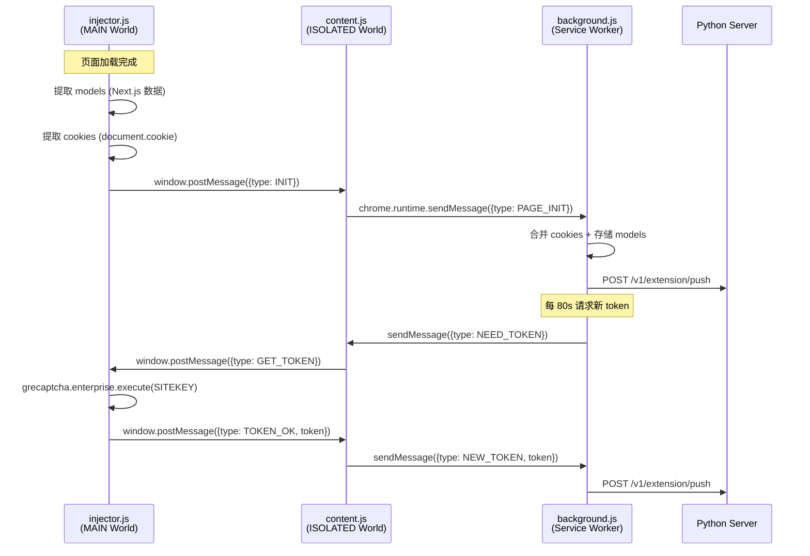
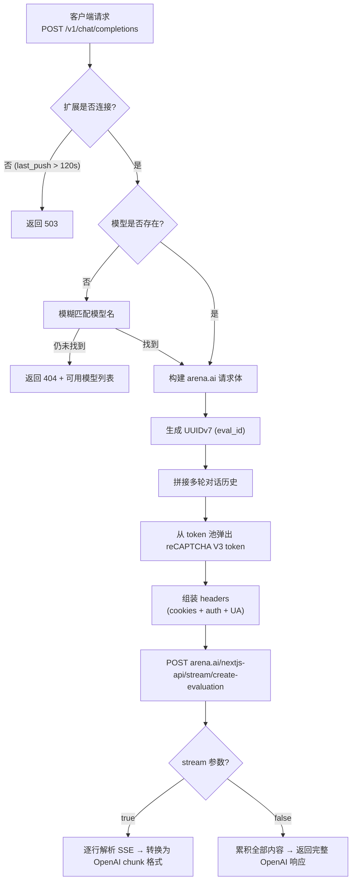

# Arena2API

将 [arena.ai](https://arena.ai) 的 300+ 模型通过 **OpenAI 兼容 API** 代理出来。

## 技术原理

### 整体架构



### 扩展内部通信

Chrome 扩展由三层脚本组成，通过消息桥接实现跨 world 通信：



### 请求处理流程

当客户端发起 `/v1/chat/completions` 请求时：



### 关键技术点

| 技术点 | 说明 |
|-------|------|
| **reCAPTCHA V3 绕过** | 扩展在真实浏览器环境中调用 `grecaptcha.enterprise.execute()`，获得高评分 token（有效期 ~2 分钟） |
| **双 World 注入** | `injector.js` 运行在 MAIN world 可访问页面全局变量（grecaptcha、Next.js 数据）；`content.js` 运行在 ISOLATED world 可访问 Chrome API |
| **Cookie 分片处理** | arena.ai 的 auth cookie 可能被分片存储为 `arena-auth-prod-v1.0` + `arena-auth-prod-v1.1`，服务器自动拼接 |
| **Token 池管理** | 维护最多 10 个 V3 token 的滚动池，每 80 秒自动补充，过期 token (>120s) 自动清理 |
| **SSE 协议转换** | arena.ai 使用自定义前缀（`a0:` 文本、`ag:` 推理、`ad:` 完成、`a2:` 心跳/图片、`a3:` 错误），服务器转换为标准 OpenAI SSE 格式 |
| **模型自动发现** | 从 Next.js 的 `__NEXT_DATA__` 或 `__next_f` 中提取 `initialModels`，自动分类 text / image / vision 模型 |

## 快速开始

### 前置要求

- Python 3.8+
- Chrome 或 Firefox 浏览器
- 一个 [arena.ai](https://arena.ai) 账号（免费注册）

### Step 1: 启动服务器

```bash
pip install -r requirements.txt
python server.py
```

服务器默认监听 `http://localhost:9090`，启动后会等待扩展连接。

### Step 2: 安装浏览器扩展

#### Chrome 扩展

1. 打开 Chrome，地址栏输入 `chrome://extensions/`
2. 开启右上角的 **开发者模式**
3. 点击 **加载已解压的扩展程序**
4. 选择项目中的 `extension/` 目录

#### Firefox 扩展

1. 打开 Firefox，地址栏输入 `about:debugging#/runtime/this-firefox`
2. 点击 **临时载入附加组件**
3. 选择项目中的 `extension-firefox/manifest.json` 文件

### Step 3: 连接 Arena.ai

1. 点击扩展图标，点击 **Open Arena.ai** 按钮（或手动打开 `https://arena.ai/?mode=direct`）
2. 等待页面完全加载（约 3-5 秒）
3. 再次点击扩展图标，确认以下状态均为绿色：
   - **Server** → Connected
   - **Arena Tab** → Active
   - **Auth Cookie** → Yes
   - **Models** → 数量 > 0

### Step 4: 调用 API

```bash
# 查看所有可用模型
curl http://localhost:9090/v1/models

# 非流式聊天
curl http://localhost:9090/v1/chat/completions \
  -H "Content-Type: application/json" \
  -d '{
    "model": "GPT-4o",
    "messages": [{"role": "user", "content": "Hello!"}]
  }'

# 流式聊天
curl http://localhost:9090/v1/chat/completions \
  -H "Content-Type: application/json" \
  -d '{
    "model": "Claude 3.5 Sonnet",
    "messages": [{"role": "user", "content": "Hello!"}],
    "stream": true
  }'
```

### 在 OpenAI SDK 中使用

```python
from openai import OpenAI

client = OpenAI(
    base_url="http://localhost:9090/v1",
    api_key="not-needed",  # 无需 API Key
)

# 流式输出
response = client.chat.completions.create(
    model="GPT-4o",
    messages=[{"role": "user", "content": "Hello!"}],
    stream=True,
)

for chunk in response:
    if chunk.choices[0].delta.content:
        print(chunk.choices[0].delta.content, end="")
```

### 支持的客户端

本服务兼容以下客户端和API网关：

- **OpenAI SDK** - 标准 OpenAI 格式
- **Claude Code** - Anthropic Claude 客户端
- **Gemini API** - Google Gemini 客户端
- **Codex** - OpenAI Codex 客户端
- **OpenCode** - 开源代码助手
- **NewAPI** - OpenAI API 网关
- **OneAPI** - 统一 API 网关

服务器会自动检测客户端类型（通过 User-Agent）并适配相应的响应格式。

## API 端点

| 端点 | 方法 | 说明 |
|------|------|------|
| `/v1/models` | GET | 列出所有可用模型（OpenAI 格式） |
| `/v1/chat/completions` | POST | 聊天补全，支持 `stream: true/false` |
| `/v1/extension/push` | POST | 扩展推送 token/cookies/models（内部使用） |
| `/v1/extension/status` | GET | 查看扩展连接状态和 token 池信息 |
| `/health` | GET | 健康检查 |

## 配置

### 服务器

| 环境变量 | 默认值 | 说明 |
|---------|--------|------|
| `PORT` | `9090` | 服务器监听端口 |
| `DEBUG` | - | 设置任意值开启调试日志 |

### 扩展

点击扩展图标，在弹窗中可修改 **Server URL**（默认 `http://127.0.0.1:9090`）。

### Chrome vs Firefox 差异

| 特性 | Chrome 扩展 | Firefox 扩展 |
|------|------------|-------------|
| Manifest 版本 | V3 (Service Worker) | V2 (Background Script) |
| API 命名空间 | `chrome.*` | `browser.*` (兼容 `chrome.*`) |
| 目录 | `extension/` | `extension-firefox/` |

## 项目结构

```
arena2api/
├── server.py              # FastAPI 代理服务器（OpenAI 格式转换 + arena.ai 调用）
├── requirements.txt       # Python 依赖（fastapi, uvicorn, httpx）
├── extension/             # Chrome 扩展 (Manifest V3)
│   ├── manifest.json      # 扩展清单（权限、脚本注入配置）
│   ├── background.js      # Service Worker — token 池管理、cookie 刷新、定时推送
│   ├── content.js         # Content Script (ISOLATED) — injector ↔ background 消息桥
│   ├── injector.js        # Page Script (MAIN) — reCAPTCHA 调用、模型提取、cookie 读取
│   ├── popup.html/js      # 扩展弹窗 UI（状态监控、手动操作）
│   └── icons/             # 扩展图标
├── extension-firefox/     # Firefox 扩展 (Manifest V2)
│   ├── manifest.json      # Firefox 扩展清单
│   ├── background.js      # Background Script — 兼容 Firefox API
│   ├── content.js         # Content Script — 兼容 Firefox API
│   ├── injector.js        # Page Script（与 Chrome 版本相同）
│   ├── popup.html/js      # 扩展弹窗 UI
│   └── icons/             # 扩展图标
└── README.md
```

## 常见问题

### 扩展状态显示 Disconnected

确认 Python 服务器已启动且端口正确。扩展每 30 秒自动推送一次，也可点击 **Push** 按钮手动触发。

### 模型列表为空

确保 arena.ai 页面已完全加载。模型列表从页面的 Next.js 数据中提取，如果页面未加载完成则无法获取。尝试刷新 arena.ai 页面。

### 请求返回 503

扩展超过 120 秒未推送数据，服务器判定连接断开。检查 arena.ai 标签页是否仍然打开，或重新打开页面。

### Token 不足导致请求失败

reCAPTCHA token 有效期约 2 分钟，扩展每 80 秒自动补充。如果短时间内大量请求耗尽 token 池，稍等片刻即可恢复。

## 注意事项

- **需要保持 arena.ai 标签页打开** — 扩展依赖页面环境获取 reCAPTCHA token
- **Token 有效期约 2 分钟** — 扩展自动刷新，高频请求时可能需要等待补充
- **免费使用** — arena.ai 本身免费，本工具仅做协议格式转换
- **模型名称** — 使用 arena.ai 原始名称（如 `GPT-4o`、`Claude 3.5 Sonnet`），通过 `/v1/models` 查看完整列表
- **仅限本地使用** — 服务器默认监听 `0.0.0.0`，生产环境请注意网络安全
